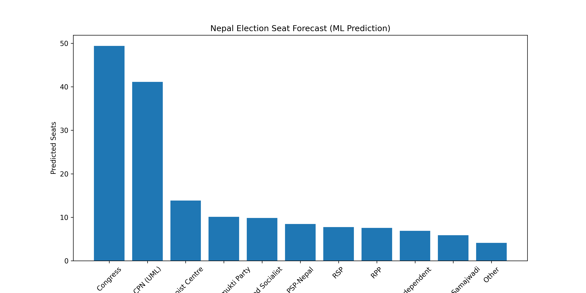

# 🇳🇵 Nepal Federal Election Prediction using Machine Learning

This project predicts Nepal Federal Parliament election outcomes using Machine Learning and historical election data.

The model analyzes past election results and estimates future seat distribution using probabilistic simulation and statistical learning techniques.

---

## 📊 Project Overview

This project uses official Nepal Federal Election data from:

- 2017 Federal Election
- 2022 Federal Election
- All 165 FPTP constituencies

The objective is to predict:

- Winning party per constituency  
- Win probability per constituency  
- National seat distribution forecast  
- Uncertainty ranges using simulation  

---

## 🧠 Machine Learning Model

Model used:

- Algorithm: Random Forest Classifier  
- Calibration: CalibratedClassifierCV  
- Simulation: Monte Carlo Simulation (5000 runs)  

Features used:

- Previous election winner  
- Party transition patterns  
- Party historical strength  
- Constituency stability indicator  

The model produces probabilistic predictions rather than deterministic guesses.

---

## 📈 Forecast Results (Predicted Seat Distribution)

| Party | Predicted Seats |
|------|----------------|
| Congress | ~49 |
| CPN (UML) | ~41 |
| Maoist Centre | ~14 |
| Unified Socialist | ~10 |
| RPP | ~9 |
| PSP-Nepal | ~8 |
| RSP | ~7 |
| Independent | ~6 |
| Others | Remaining |

Total seats: 165

---

## 📊 Visualization

Seat forecast generated using Machine Learning model:

---

## 📁 Project Structure

nepal-election-ml-prediction/

data/
- winners_2017.csv
- winners_2022.csv
- ml_dataset_clean_165.csv
- final_predictions_submission.csv
- seat_forecast_uncertainty.csv

nepal_election_analysis.ipynb  
seat_forecast.png  
README.md  

---

## ⚙️ Technologies Used

- Python  
- pandas  
- numpy  
- scikit-learn  
- matplotlib  
- Jupyter Notebook  

---

## 🎯 Key Features

- Covers all 165 constituencies  
- Machine Learning based prediction  
- Probabilistic modeling  
- Monte Carlo uncertainty simulation  
- Fully reproducible workflow  
- Visualization included  

---

## 🚀 How to Run

Install dependencies:

pip install pandas numpy scikit-learn matplotlib

Open notebook:

nepal_election_analysis.ipynb

Run all cells.

---

## 📌 Outputs Generated

- final_predictions_submission.csv → constituency predictions  
- seat_forecast_uncertainty.csv → national seat forecast  
- seat_forecast.png → forecast visualization  

---

## 👨‍💻 Author

Sanjay Oli  
Machine Learning & Cybersecurity Student  
Sydney, Australia  

GitHub:  
https://github.com/olisanjay158-ops

---

## 📜 Purpose

This project was developed for educational, research, and portfolio purposes to demonstrate Machine Learning prediction and probabilistic modeling techniques.